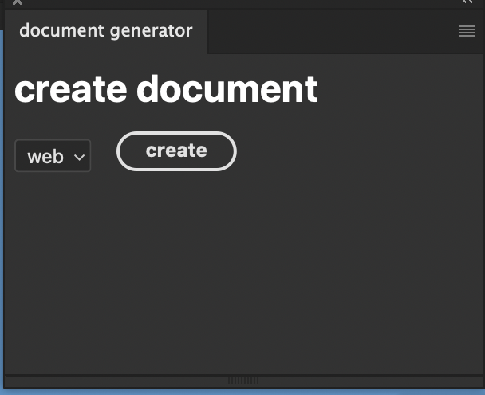

<h1>example of Photoshop UXP plugin document generator</h1>

    this is a simple exmaple UX plugin document generator. it makes template document from class Object.
    just I'd like to show how write modern code on Photoshop UXP.
    more details below.

<h2>DocumentPreset class</h2>

    the class recieves args like width , height ... as a option of document.
    and it makes document , layers , draws guides omn document.

<h2>Layer class</h2>

    LayerObj and LayerSetObj create layer and it will get layer itself from native Photoshop app after it made layer from method.
    layerSetObj . it's a group layer Object so it has to have layers as a property.

