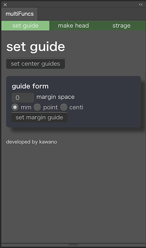

<h1>Illustrator用Extension　multiFuncs</h1>
<h2>Illustrator用のExtensionの開発の流れを知るためのExtension</h2>

    タブによるUIの切り替え、formを使用した数値の入力とパネルのjsとjsxの通信、等の一連の流れを開発を通じて知ることができます。勿論普通のExtensionとしても使用可能。詳細は以下のリンクより

<a href="https://kawano-shuji.com/justdiary/2020/10/29/adobe-illustrator-extension%e3%81%ae%e9%96%8b%e7%99%ba-%e8%84%b1hello-world%e3%81%9d%e3%81%ae1/">Adobe Illustrator Extensionの開発 脱Hello Worldその1</a>